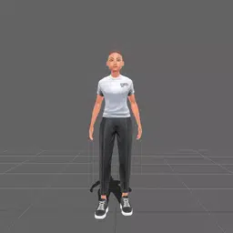
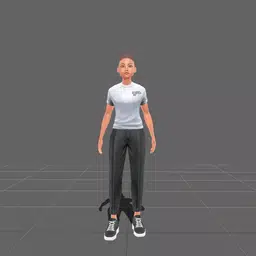
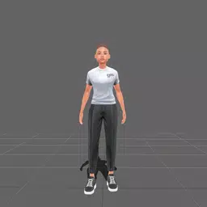
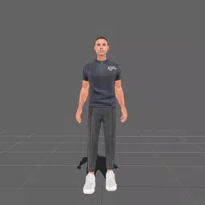
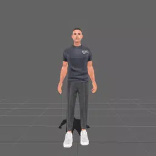
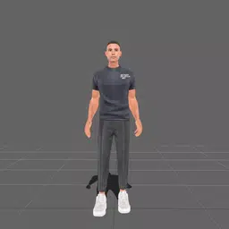

    

# Game-Ready Animation Library by Ready Player Me

### Version 1.0.0 - Published June 2023

### Contents

- [Overview](#overview)
- [Animations](#animations)
  - [Feminine Animations](#feminine-armature-animations)
  - [Masculine Animations](#masculine-armature-animations)
- [Frequently Asked Questions](#faq)
- [Tutorials](#tutorials)
- [Notes](#notes)

## Overview

This repository contains the initial batch of 200+ high quality motion captured animations that have been retargeted to Ready Player Me character armatures. We provide these animations free for you to use in any of your projects as per the license found [here](LICENSE.md).

All of the animations in this library were captured using both male and female actors in a professional motion capture studio. All animations captured from both male and female actors have been retargeted to each Ready Player Me character.

## Animations

You will find links below to all the character animations broken down by animation category and retargeted to the latest Ready Player Me Feminine and Masculine armatures.

 

### Feminine Armature Animations

Click here to access the entire [Ready Player Me Feminine Character Library](/feminine/)

<table style="width: 100%; table-layout: fixed;">
<tr>
<td style="width: 25%;">

  
 <a href="feminine/fbx/locomotion" target="_blank">Locomotion</a>

</td>
<td style="width: 25%;">

  
 <a href="feminine/fbx/dance" target="_blank">Dance</a>

</td>
<td style="width: 25%;">

  
 <a href="feminine/fbx/expression" target="_blank">Expression</a>

</td>
<td style="width: 25%;">

  
 <a href="feminine/fbx/idle" target="_blank">Idle</a>

</td>
</tr>
</table>

 

### Masculine Armature Animations

Click here to access the entire [Ready Player Me Masculine Character Library](/masculine/)

<table style="width: 100%; table-layout: fixed;">
<tr>
<td style="width: 25%;">

  
 <a href="masculine/fbx/locomotion" target="_blank">Locomotion</a>

</td>
<td style="width: 25%;">

  
 <a href="masculine/fbx/dance" target="_blank">Dance</a>

</td>
<td style="width: 25%;">

  
 <a href="masculine/fbx/expression" target="_blank">Expression</a>

</td>
<td style="width: 25%;">

  
 <a href="masculine/fbx/idle" target="_blank">Idle</a>

</td>
</tr>
</table>

<!--
*(Click on the character name in the table below to preview and download the available animations for a specific Ready Player Me character)*

| Character | Description |
| --------- | ----------- |
| [Female](/feminine/) | Animations retargeted to Ready Player Me Female Armature |
| [Male](/masculine/) | Animations retargeted to Ready Player Me Male Armature |

-->
 

## FAQ

### Are these animations really free?

Yes, free as in beer! We created this animation library to help the game development community create more unique and engaging experiences. This is just the first batch of many more free releases. Please read our [license for more details](LICENSE.md).

### Can I use these animations with characters that are not from Ready Player Me?

The animations are specifically designed for Ready Player Me avatars and are not intended to be used with other characters.

### When will more animations be released?

This is just the first batch of animations we're releasing to the community. We will continue releasing animations throughout 2023 and beyond.

### What software do I need to use with these animations?

You can use any software that supports the FBX file type, including Unity, Unreal Engine, Blender, Maya, Sketchfab, etc.

### Where can I get help using these animations?

Please check out the tutorial below. If you're already a Ready Player Me partner you can email support@readyplayer.me with additional questions, or sign up as a developer at [readyplayer.me/developers](https://readyplayer.me/developers).

 

## Tutorials

We provide the following general guides to loading the provided animations on Ready Player Me avatars in Unity and Unreal Engine. However, other approaches and configurations maybe required depending on your own project needs.

[Using animations in Unity](/guides/Unity-Guide.md)

[Using animations in Unreal](/guides/Unreal-Guide.md)

We always aim to provide our partners with the highest quality assets, please let us know if you encounter any issues using these animations on your loaded Ready Player Me avatars, such as mesh deformation problems in extreme poses or any unexpected behaviour during playback.

 

## Notes

- In order to properly use this repository, you need to have Git Large File Storage (LFS) installed on your system.

- The animation filename prefix denotes which actor gender was used to generate the motion:

| Filename prefix | Description                         |
| --------------- | ----------------------------------- |
| M\_             | Motion captured from male actor     |
| F\_             | Motion captured from female actress |
