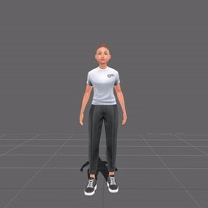
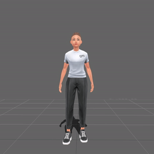
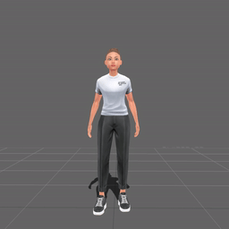
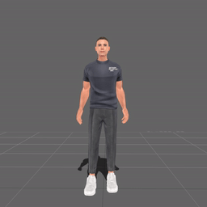
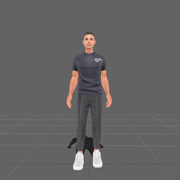
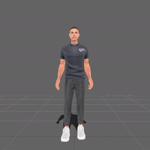

    

# Free Game-Ready Animation Library from Ready Player Me

This repository contains a library of high quality motion captured animations that have been retargeted to Ready Player Me character armatures. We provide these animations free for you to use in your projects as per the license found [here](LICENSE.md).

All of the animations in this library were captured using both male and female actors in a professional motion capture studio. All animations captured from both male and female actors have been applied to each Ready Player Me character listed below.

### Feminine Characters
Click here to access the entire [Feminine Library](/feminine/fbx/)
<table style="width: 100%; table-layout: fixed;">
<tr>
<td style="width: 25%;">

  
 <a href="feminine/fbx/locomotion" target="_blank">Locomotion</a>

</td>
<td style="width: 25%;">

  
 <a href="feminine/fbx/dance" target="_blank">Dance</a>

</td>
<td style="width: 25%;">

  
 <a href="feminine/fbx/expression" target="_blank">Expression</a>

</td>
<td style="width: 25%;">

  
 <a href="feminine/fbx/idle" target="_blank">Idle</a>

</td>
</tr>
</table>

### Masculine Characters
Click here to access the entire [Masculine Library](/masculine/fbx/)
<table style="width: 100%; table-layout: fixed;">
<tr>
<td style="width: 25%;">

  
 <a href="masculine/fbx/locomotion" target="_blank">Locomotion</a>

</td>
<td style="width: 25%;">

  
 <a href="masculine/fbx/dance" target="_blank">Dance</a>

</td>
<td style="width: 25%;">

  
 <a href="masculine/fbx/expression" target="_blank">Expression</a>

</td>
<td style="width: 25%;">

  
 <a href="masculine/fbx/idle" target="_blank">Idle</a>

</td>
</tr>
</table>

*(Click on the character name in the table below to preview and download the available animations for a specific Ready Player Me character)*

| Character | Description |
| --------- | ----------- |
| [Female](/female/fbx/) | Animations retargeted to Ready Player Me Female Armature |
| [Male](/male/fbx/) | Animations retargeted to Ready Player Me Male Armature |

## Note

The animations included in this library were captured using both male and female actors in a professional motion capture studio. All animations captured from both male and female actors have been applied to each Ready Player Me character listed in the table above.

The animation filename prefix denotes which actor gender was used to generate the motion:

| Filename prefix | Description |
| --------- | ----------- |
| M_ | Motion captured from male actor |
| F_ | Motion captured from female actress |

## Loading animations onto Ready Player Me avatars

Please refer to the tutorials found here <link to tutorials in RPM docs> to learn how to load the provided animations onto Ready Player Me avatars.
