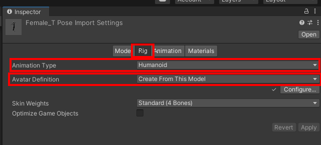
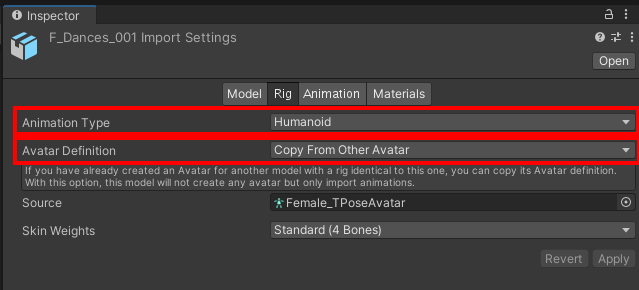
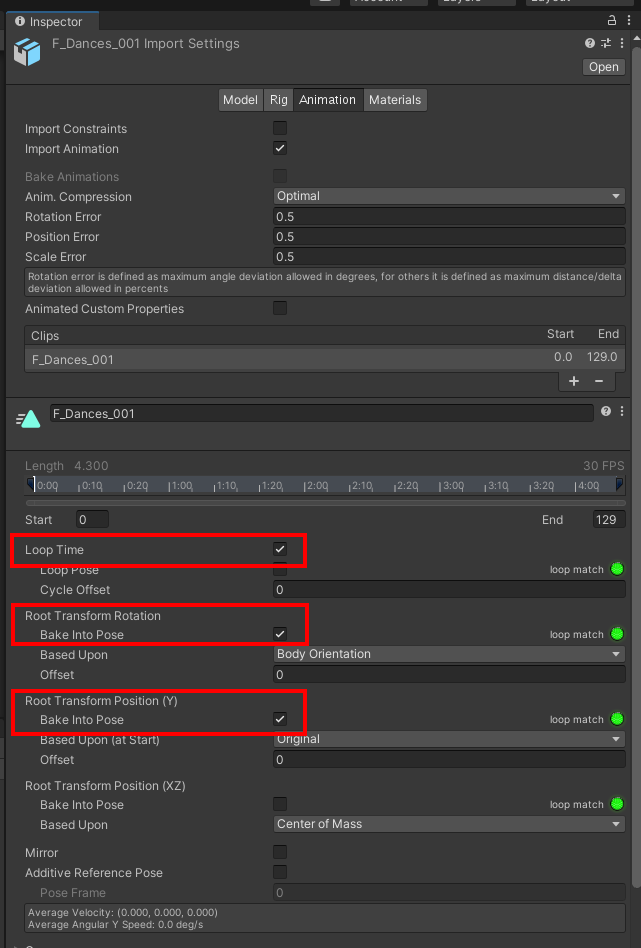
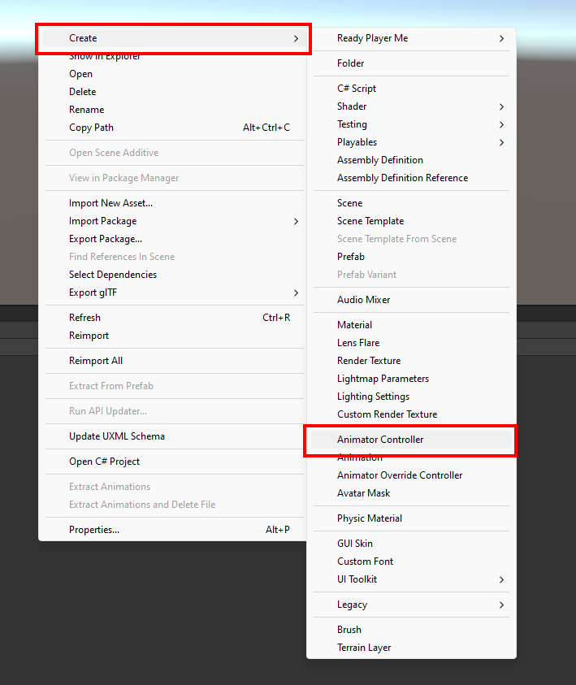

# Unity Guide

## Requirements

- Unity 2020 or higher
- Ready Player Me Unity SDK found [here](https://github.com/readyplayerme/rpm-unity-sdk-core.git)
   - details for import and setup are in the [README.md](https://github.com/readyplayerme/rpm-unity-sdk-core#readme)

This guide assumes that you have already installed the **Ready Player Me Unity SDK** that includes the Core and Avatar Loader modules, which which required for loading our avatars.

## Project setup process

1. Open up your Unity project
2. Import one of the `TPose.fbx` files. <br /> e.g. `Masculine_TPose.fbx`
3. Go to import settings Rig tab and adjust the following settings in the Inspector window
    1. **Animation Type = Humanoid**
    2. **Avatar Definition = Create from this model**

    

4. Import the animation fbx files e.g. `F_Dances_001.fbx`
5. Go to import settings  for the animations Rig tab and adjust the following settings in the Inspector window
    1. **Animation Type = Humanoid**
    2. **Avatar Definition = Avatar from step 2** *EG Masculine_TPose*
   
   

6. With the import settings still open switch to the Animation tab and adjust the following settings
    1. **Loop time = True** (Only if it is a looping animation like a walk loop)
    2. **Root Transform Rotation: Bake into Pose = True**
    3. **Root Transform Position: Bake into pose = true**
   

7. Create a new animator controller
    1. EG Right click in the project tab and click on Create > Animator Controller
   
        
    2. Then double click the newly created Animator controller file to open the Animator editor tab
    3. From here you can add the newly imported animation clips
8. Repeat the steps 1 - 6 for the `Feminine_TPose.fbx` and animation files

## Playing the animations on a runtime loaded avatar.

To apply the animations on a runtime loaded avatar we will use a slightly modified version of the [AvatarLoaderExample.cs](https://github.com/readyplayerme/rpm-unity-sdk-avatar-loader/blob/main/Samples~/AvatarLoading/AvatarLoadingExample.cs).

Firstly we create a new function called `SetAnimatorController` for setting the animator controller based on the loaded avatars outfit gender.
e.g. Masculine avatar should have masculine animator controller 
```csharp
    // This method is used to reassign the appropriate animator controller based on outfit gender
    private void SetAnimatorController(OutfitGender outfitGender)
    {
        var animator = avatar.GetComponent<Animator>();
        // set the correct animator based on outfit gender
        if (animator != null && outfitGender == OutfitGender.Masculine)
        {
            animator.runtimeAnimatorController = masculineController;
        }
        else
        {
            animator.runtimeAnimatorController = feminineController;
        }
    }
```

Next we call this function from the AvatarLoader.OnCompleted callback

```csharp
   avatarLoader.OnCompleted += (_, args) =>
   {
      avatar = args.Avatar;
      SetAnimatorController(args.Metadata.OutfitGender); //  <--------------- NEW
   };
```

The end result will be an AvatarLoader script that will look something like this.

```csharp
using ReadyPlayerMe.AvatarLoader;
using ReadyPlayerMe.Core;
using UnityEngine;

public class TestAvatarLoader : MonoBehaviour
{
    [SerializeField, Tooltip("Set this to the URL or shortcode of the Ready Player Me Avatar you want to load.")]
    private string avatarUrl = "https://api.readyplayer.me/v1/avatars/638df693d72bffc6fa17943c.glb";

    private GameObject avatar;
    // Add 2 editable fields to store the new masculine and feminine animator controllers
    [SerializeField] private RuntimeAnimatorController masculineController;
    [SerializeField] private RuntimeAnimatorController feminineController;

    private void Start()
    {
        ApplicationData.Log();
        var avatarLoader = new AvatarObjectLoader();
        // use the OnCompleted event to set the avatar and setup animator
        avatarLoader.OnCompleted += (_, args) =>
        {
            avatar = args.Avatar;
            SetAnimatorController(args.Metadata.OutfitGender); //  <--------------- ADDED
        };
        avatarLoader.LoadAvatar(avatarUrl);
    }
		
    // This method is used to reassign the appropriate animator controller based on outfit gender
    private void SetAnimatorController(OutfitGender outfitGender)
    {
        var animator = avatar.GetComponent<Animator>();
        // set the correct animator based on outfit gender
        if (animator != null && outfitGender == OutfitGender.Masculine)
        {
            animator.runtimeAnimatorController = masculineController;
        }
        else
        {
            animator.runtimeAnimatorController = feminineController;
        }
    }

    private void OnDestroy()
    {
        if (avatar != null) Destroy(avatar);
    }
}
```
