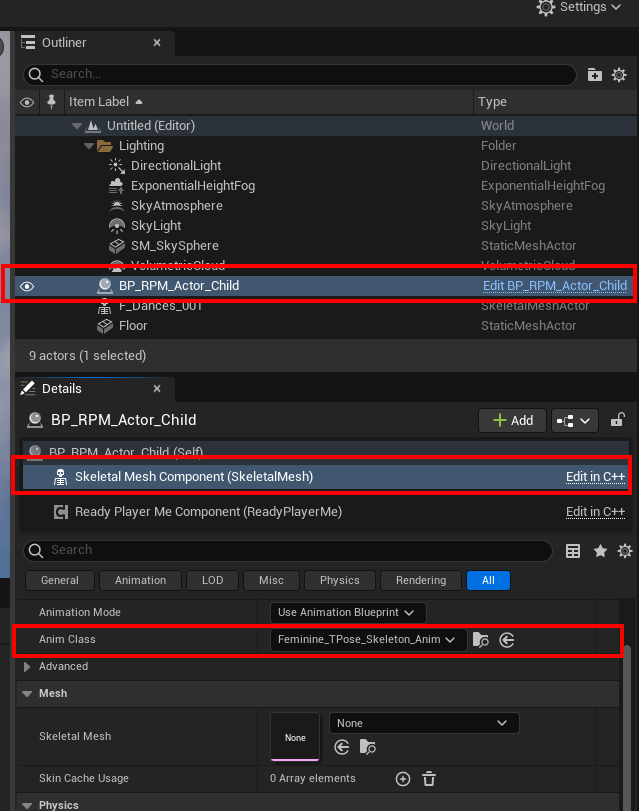

# Unreal Engine Guide

## Requirements

- Unreal Engine 4.27 or higher
- Ready Player Me Unreal SDK Plugin found [here](https://github.com/readyplayerme/rpm-unreal-sdk)
  - details for import and setup are in the README
- glTFRuntime plugin found [here](https://github.com/rdeioris/glTFRuntime.git)

This guide assumes that you have already installed the **Ready Player Me Unreal SDK** and **glTFRuntime** plugins which is required for loading our avatars.

## Project setup process

1. Download the animation pack
2. Open up your Unreal Engine project
3. Select the `Masculine_TPose.fbx` file and import it into the project (e.g drag and drop the file into editor)

   **This will be used to generate the skeleton asset that our animations will use***

4. The FBX Import Options should look like this. **Make sure to set the Skeleton to None** so it generates a new skeleton.

   

5. Click Import or Import All
6. Select all the animation files you want and import them into Unreal Engine  ***Make sure that it is using the skeleton imported from step 3!***

   

7. Next find the Masculine_TPose skeleton and right click. From the menu go to `Create > Create animation blueprint`.

   

8. From here add the animations and setup the animator states as needed

   

## Loading avatars with new animations

1. Find the RPM actor blueprint `BP_RPM_Actor` and either edit or right click and create a child class from it that you can edit.

   

2. Drag this Actor BP into your map
3. Select it in the hierarchy and click on the **Skeletal Mesh Component** from the **Details** panel
4. Set the **Anim Class** property to the **Animation Blueprint** you just created

5. Select the **Ready Player Me Component** and set the **Target Skeleton** to your newly imported skeleton

   

6. Set the `Url Shortcode` to an avatar URL you wish to load

   

7. Run the application and you should see an avatar load with the animation playing
     